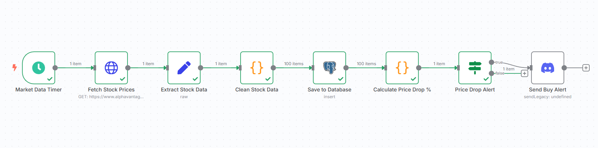
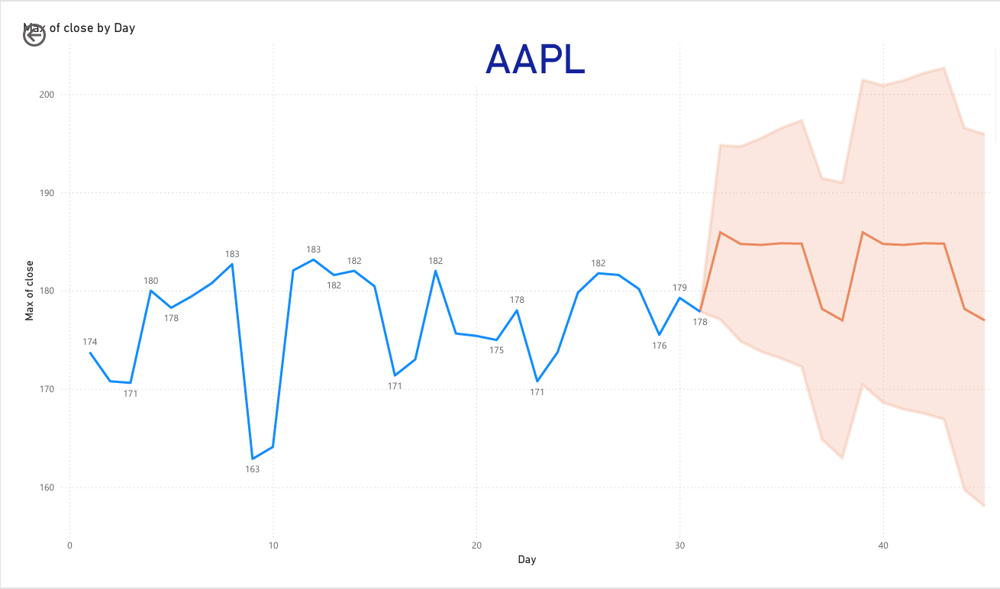

# 📈 Automated Stock Analytics Pipeline

An end-to-end automated data pipeline that fetches real-time stock market data, processes it through ETL workflows, stores it in PostgreSQL, and provides intelligent analytics with predictive forecasting for the next 14 days and automated Discord alerts for trading opportunities.

## 🚀 What It Does

- Fetches live stock prices from Alpha Vantage API
- Stores data in PostgreSQL database
- Creates Power BI dashboards with price forecasting
- Sends Discord alerts for buy opportunities (5%+ price drops)
- Runs automatically on schedule

## 📈 Demo
### 
 Workflow Overview 

### 
 Power BI Dashboard 

## 🛠️ Tech Stack

- **Automation**: n8n
- **Database**: PostgreSQL
- **Analytics**: Power BI
- **Alerts**: Discord Webhooks
- **API**: Alpha Vantage

## ⚡ Quick Setup

1. Install n8n: `npm install -g n8n`
2. Create PostgreSQL database and table
3. Import workflow JSON into n8n
4. Add API key and Discord webhook
5. Connect Power BI to database

## 📊 Features

- **Smart Alerts**: Notifications for significant price drops
- **Predictive Analytics**: Power BI forecasting models  
- **Automated ETL**: Data cleaning and transformation
- **Real-time Processing**: Scheduled data updates

## 📈 Portfolio Impact

Demonstrates end-to-end data engineering skills:
- API integration and data extraction
- ETL pipeline development
- Database design and management
- Business intelligence and visualization
- Process automation and monitoring

Built for personal trading analysis and portfolio diversification insights.

